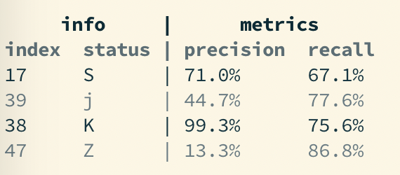

# treetable

Helper to pretty print an ascii table with a tree-like structure.

## Installation and requirements

`treetable` requires at least python3.6.
```
pip3 install treetable
```


## Quick example

`treetable` allows to easily output complex ascii tables like

```
         ||                 ||              metrics
         ||       info      ||      train     |       test
name     ||  index  status  ||     Pr  recall |   auc  accuracy
RirpUoE  ||  21     L       ||  94.4%   56.4% | 46.3%     79.6%
wtAYHBf  ||                 ||
j        ||                 ||
rLsITTK  ||  47     q       ||  66.0%   84.8% | 46.5%     64.9%
S        ||                 ||
Uumlvod  ||  49     Z       ||  63.1%   99.8% | 94.6%     10.6%
SmIsO    ||                 ||
rzXlDqM  ||  32     J       ||  48.8%   33.5% | 30.8%     94.2%
PyCX     ||                 ||
```

## Usage and examples

The main function is `treetable.treetable`. It takes a tree-like structure
to represent the table. For instance, I could have a sub-table `info` and
a sub-table `metrics`, each one being recursively composed of other sub-tables.

Each extra level of sub-tables use a different separator (by default up to 3
levels but you can provide extra separators with the `separators` arguments).

At the leaf level of the tree, a format string (that can be passed to the
`format` builtin) can be specified. Let's take an example

```python
from treetable import table, group, leaf

mytable = table([
    group('info', [
        leaf('name'),
        leaf('index')]),
    group('metrics', align='>', groups=[
        leaf('speed', '.0f'),
        leaf('accuracy', '.1%'),
        leaf('special', '.1%', align='=')]),
])
```

The lines of the table should be provided following a list of nested
dictionaries with the same shape, for instance:

```python
lines = [
    {'info': {'name': 'bob', 'index': 4}, 'metrics':{'speed': 200, 'accuracy': 0.21, 'special': 0.1}},
    {'info': {'name': 'alice', 'index': 2}, 'metrics':{'speed': 67, 'accuracy': 0.45, 'special': 4.56}},
]
```

Now running `print(treetable(lines, groups))` will give you

```
    info     |         metrics
name   index | speed  accuracy  special
bob    4     |   200     21.0%   10.0%
alice  2     |    67     45.0%   456.0%
```

`table`, `group` and `leaf` are all node definition functions. They all
accept the same arguments and differ only in the order of positional arguments.
When defined in a leaf node, the arguments will directly influence
how the data is rendered. In group nodes or the root (aka table) node,
they will override the default behaviors in descendent leafs. The following
arguments are defined:
- `key`: access key in the `lines` data structure.
- `groups` (only for `group` and `table` nodes): list of sub-tables.
- `display`: display name used, when different to the name to access
    the value in the `lines` structure.
- `align`: alignment of text, either '<' (left aligned), '=' (centered) or
    '>' (right aligned).
- `wrap`: wrap text beyond a certain number of characters. No smart wrapping,
    this will wrap exactly at the limit characters by inserting a new line.
- `missing`: value used when a specific key is not present. Default
    is `''`.
- `shorten`: automatically shorten columns names. They are not shorten
    any more than the width of the underlying column and a long enough prefix
    is kept to remove any possible ambiguity with other columns in the same
    sub-tab le.


For instance, when using `shorten=True` with the above table:
```
  info   |       metrics
name   i | spee  accur  specia
bob    4 |  200  21.0%  10.0%
alice  2 |   67  45.0%  456.0%
```

`name` wasn't shortened because `alice` is longer than `name` so there would
be no point in shortening it. However `speed` is kept long enough
to avoid ambiguity with `special`.

When setting `wrap=3` for the `name` column we obtain the following:
```
 info  |       metrics
nam  i | spee  accur  specia
bob  4 |  200  21.0%  10.0%
ali  2 |   67  45.0%  456.0%
ce     |
```

It is possible to customize the column separators by passing
`separators` to the `treetable` function. Its default value is
`['  ', ' | ', '  ||  ']`.


### Colors

It is possible to use ANSI color codes by passing a list of color codes to `treetable()` with the `colors` argument.
The i-th line (including headers) will have the color `colors[i % len(colors]`. For instance:

```python
treetable(lines, mytable, colors=["30", "39"])
```




## License

`treetable` is distributed under the Unlicense license.
See the LICENSE file for more information.
